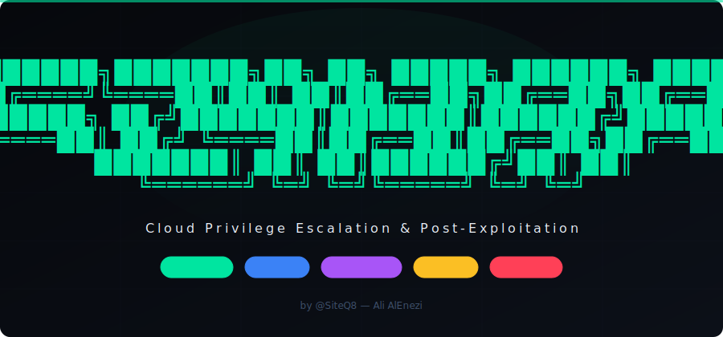
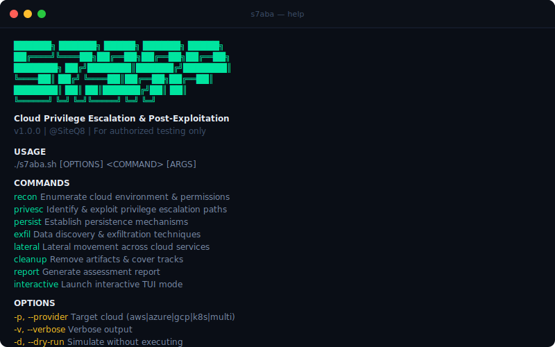
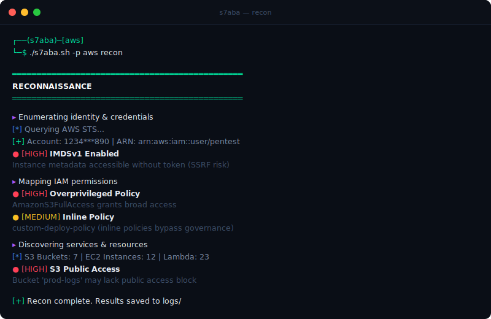
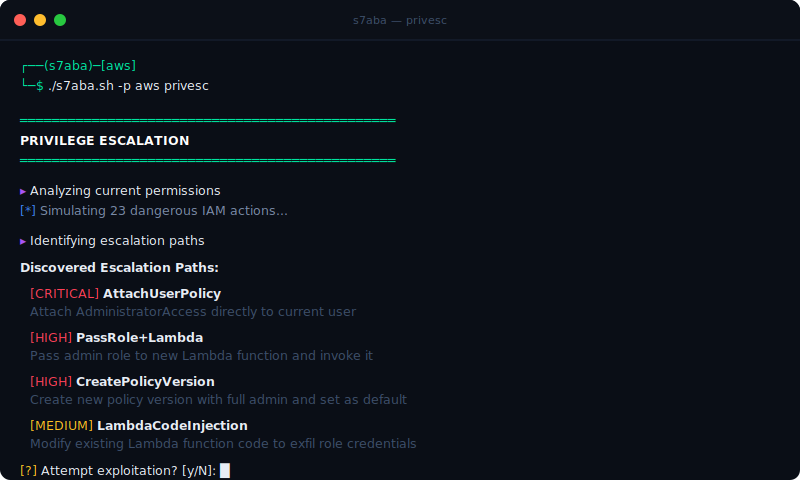

<p align="center">
  
</p>

<p align="center">
  <strong>Cloud Privilege Escalation & Post-Exploitation Framework</strong>
</p>

<p align="center">
  <a href="#-quick-start"></a>
  <a href="LICENSE"></a>
  <a href="#-supported-providers"></a>
  <a href="#"></a>
  <a href="https://github.com/SiteQ8/S7aba/stargazers"></a>
  <a href="https://github.com/SiteQ8/S7aba/issues"></a>
  <a href="SECURITY.md"></a>
</p>

<p align="center">
  <a href="#-features">Features</a> •
  <a href="#-quick-start">Quick Start</a> •
  <a href="#-usage">Usage</a> •
  <a href="#-attack-flow">Attack Flow</a> •
  <a href="#-supported-providers">Providers</a> •
  <a href="#-contributing">Contributing</a>
</p>

---

## ⚠️ Legal Disclaimer

**S7aba is designed for authorized security testing only.** Usage of this tool for attacking targets without prior mutual consent is illegal. It is the end user's responsibility to obey all applicable local, state, and federal laws. The author assumes no liability and is not responsible for any misuse or damage caused by this program.

---

## 🔍 What is S7aba?

**S7aba** (صعبة — Arabic for "difficult/tough") is a pure Bash cloud privilege escalation and post-exploitation framework designed for red teamers, penetration testers, and cloud security professionals.

It auto-detects your cloud environment, enumerates permissions and misconfigurations, identifies privilege escalation paths, and provides post-exploitation capabilities — all from a single command-line tool with **zero dependencies** beyond standard cloud CLIs.

### Why S7aba?

- **Pure Bash** — No Python, Go, or Ruby required. Runs anywhere Bash runs
- **Multi-Cloud** — Single framework for AWS, Azure, GCP, and Kubernetes
- **Modular** — Plug-and-play modules for each provider and attack phase
- **Safe by Default** — Dry-run mode, confirmation prompts, full audit logging
- **Extensible** — Add new providers or techniques by creating simple shell scripts

---

## 📸 Screenshots

### Help Menu
<p align="center">
  
</p>

### Cloud Reconnaissance
<p align="center">
  
</p>

### Privilege Escalation Discovery
<p align="center">
  
</p>

---

## ✨ Features

| Phase | Capability | Description |
|-------|-----------|-------------|
| 🔍 **Recon** | Identity & Permissions | Enumerate IAM users, roles, policies, and effective permissions |
| 🔍 **Recon** | Service Discovery | Map S3, EC2, Lambda, RDS, and other cloud resources |
| 🔍 **Recon** | Network Analysis | VPCs, security groups, public endpoints, IMDS configuration |
| 🔍 **Recon** | Secret Scanning | SSM parameters, Secrets Manager, Lambda env vars |
| ⚡ **Privesc** | IAM Escalation | 14+ AWS privilege escalation methods (Rhino Security style) |
| ⚡ **Privesc** | Policy Abuse | CreatePolicyVersion, SetDefaultPolicyVersion, inline policies |
| ⚡ **Privesc** | Role Chaining | PassRole+Lambda, PassRole+EC2, PassRole+CloudFormation |
| 🔗 **Lateral** | Trust Mapping | Cross-account roles, service-linked roles, federation |
| 🔗 **Lateral** | Service Pivots | Move between cloud services using discovered credentials |
| 🛡️ **Persist** | IAM Backdoors | Create persistent access through IAM manipulation |
| 📤 **Exfil** | Data Discovery | Find and classify sensitive data across cloud storage |
| 🧹 **Cleanup** | Artifact Removal | Remove traces, logs, and created resources |
| 📊 **Report** | Multi-Format | Generate reports in Text, JSON, or HTML |

---

## 🚀 Quick Start

```bash
# Clone
git clone https://github.com/SiteQ8/S7aba.git
cd S7aba

# Make executable
chmod +x s7aba.sh

# Run reconnaissance (auto-detects cloud provider)
./s7aba.sh recon

# Or specify provider
./s7aba.sh -p aws recon
```

### Prerequisites

**Required:**
- Bash 4.0+
- `curl`, `jq`, `grep`, `awk`, `sed`, `base64`

**At least one cloud CLI:**
- AWS CLI (`aws`) — for AWS assessments
- Azure CLI (`az`) — for Azure assessments
- Google Cloud SDK (`gcloud`) — for GCP assessments
- kubectl — for Kubernetes assessments

---

## 📖 Usage

```
./s7aba.sh [OPTIONS] <COMMAND> [ARGS]

COMMANDS:
  recon          Enumerate cloud environment & permissions
  privesc        Identify & exploit privilege escalation paths
  persist        Establish persistence mechanisms
  exfil          Data discovery & exfiltration techniques
  lateral        Lateral movement across cloud services
  cleanup        Remove artifacts & cover tracks
  report         Generate assessment report
  interactive    Launch interactive TUI mode

OPTIONS:
  -p, --provider   Target cloud (aws|azure|gcp|k8s|multi)
  -r, --region     Target region
  -o, --output     Output format (text|json|html)
  -v, --verbose    Verbose output
  -d, --dry-run    Simulate without executing
  -h, --help       Show help
  --version        Show version
```

### Examples

```bash
# Full recon with verbose logging
./s7aba.sh -v -p aws recon

# Privilege escalation scan (dry-run)
./s7aba.sh -p aws -d privesc

# Kubernetes lateral movement
./s7aba.sh -p k8s lateral

# Generate HTML report
./s7aba.sh -o html report

# Interactive TUI mode
./s7aba.sh interactive
```

---

## 🎯 Attack Flow

```
┌──────────────┐     ┌──────────────┐     ┌──────────────┐
│    RECON      │────▶│   PRIVESC    │────▶│   LATERAL    │
│              │     │              │     │   MOVEMENT   │
│ • Identity   │     │ • IAM Paths  │     │ • Trust Map  │
│ • Permissions│     │ • Policy Abuse│    │ • Svc Pivots │
│ • Services   │     │ • Role Chain │     │ • Targets    │
│ • Network    │     │ • Exploit    │     │              │
└──────────────┘     └──────────────┘     └──────┬───────┘
                                                  │
┌──────────────┐     ┌──────────────┐     ┌──────▼───────┐
│    REPORT    │◀────│   CLEANUP    │◀────│  PERSIST &   │
│              │     │              │     │   EXFIL      │
│ • Text/JSON  │     │ • Remove     │     │ • Backdoors  │
│ • HTML       │     │   artifacts  │     │ • Data Disc. │
│ • Findings   │     │ • Cover logs │     │ • Exfil Chan.│
└──────────────┘     └──────────────┘     └──────────────┘
```

### AWS Privilege Escalation Methods

S7aba checks for **14+ known AWS IAM privilege escalation techniques**:

| # | Method | Risk | Description |
|---|--------|------|-------------|
| 1 | `CreatePolicyVersion` | HIGH | Create admin policy version, set as default |
| 2 | `SetDefaultPolicyVersion` | HIGH | Switch to older, more permissive policy version |
| 3 | `PassRole+Lambda` | HIGH | Pass admin role to Lambda function |
| 4 | `PassRole+EC2` | HIGH | Launch EC2 with admin instance profile |
| 5 | `AttachUserPolicy` | CRITICAL | Attach AdministratorAccess to self |
| 6 | `AttachGroupPolicy` | HIGH | Attach admin policy to user's group |
| 7 | `PutUserPolicy` | CRITICAL | Add inline admin policy to user |
| 8 | `AddUserToGroup` | HIGH | Join admin group |
| 9 | `UpdateAssumeRolePolicy` | HIGH | Modify admin role trust policy |
| 10 | `PassRole+CloudFormation` | HIGH | CFN stack with admin role |
| 11 | `LambdaCodeInjection` | MEDIUM | Modify Lambda to exfil credentials |
| 12 | `SSMCommand` | HIGH | Execute on EC2 via SSM |
| 13 | `CreateAccessKey` | MEDIUM | Generate keys for other users |
| 14 | `PassRole+Glue` | HIGH | Glue dev endpoint with admin role |

---

## ☁️ Supported Providers

| Provider | Status | Recon | Privesc | Lateral | Persist | Exfil |
|----------|--------|-------|---------|---------|---------|-------|
| **AWS** | ✅ Ready | ✅ | ✅ | 🔧 | 🔧 | 🔧 |
| **Azure** | 🟡 Beta | 🔧 | 🔧 | 🔧 | 🔧 | 🔧 |
| **GCP** | 🟡 Beta | 🔧 | 🔧 | 🔧 | 🔧 | 🔧 |
| **Kubernetes** | 🔵 Dev | 🔧 | 🔧 | 🔧 | 🔧 | 🔧 |

✅ = Complete | 🔧 = In Development | 🔵 = Planned

---

## 📁 Project Structure

```
S7aba/
├── s7aba.sh                  # Main entry point
├── src/
│   ├── lib/
│   │   ├── utils.sh          # Utility functions
│   │   ├── logger.sh         # Logging & output formatting
│   │   └── cloud_detect.sh   # Cloud provider auto-detection
│   └── modules/
│       ├── recon_aws.sh       # AWS reconnaissance
│       ├── privesc_aws.sh     # AWS privilege escalation
│       ├── lateral_*.sh       # Lateral movement modules
│       ├── persist_*.sh       # Persistence modules
│       ├── exfil_*.sh         # Data exfiltration modules
│       ├── cleanup_*.sh       # Cleanup modules
│       └── report.sh          # Report generation
├── ui/
│   └── index.html             # Web UI landing page
├── docs/
│   └── screenshots/           # Documentation screenshots
├── logs/                      # Runtime logs (gitignored)
├── reports/                   # Generated reports (gitignored)
├── SECURITY.md                # Security policy
├── CONTRIBUTING.md            # Contribution guidelines
├── CODE_OF_CONDUCT.md         # Code of conduct
├── LICENSE                    # MIT License
└── README.md                  # This file
```

---

## 🤝 Contributing

Contributions are welcome! Whether it's new cloud provider modules, additional escalation techniques, bug fixes, or documentation improvements.

See [CONTRIBUTING.md](CONTRIBUTING.md) for guidelines.

### Areas for Contribution

- 🔧 **Azure/GCP/K8s modules** — Implement recon, privesc, lateral, persist, exfil
- 🧪 **New escalation techniques** — Add emerging IAM abuse methods
- 📊 **Report templates** — PDF reports, SARIF output, integration with platforms
- 🧹 **Testing** — Unit tests, integration tests, CI/CD
- 📖 **Documentation** — Tutorials, walkthroughs, video demos

---

## 🔒 Security

Found a vulnerability? Please report it responsibly.

See [SECURITY.md](SECURITY.md) for our security policy and disclosure process.

**Do NOT open public issues for security vulnerabilities.**

---

## 📄 License

This project is licensed under the MIT License — see [LICENSE](LICENSE) for details.

---

## 🙏 Acknowledgments

- [Rhino Security Labs](https://rhinosecuritylabs.com/) — AWS IAM privilege escalation research
- [PayloadsAllTheThings](https://github.com/swisskyrepo/PayloadsAllTheThings) — Cloud security references
- [HackTricks Cloud](https://cloud.hacktricks.xyz/) — Cloud pentesting methodology
- [Prowler](https://github.com/prowler-cloud/prowler) — Inspiration for cloud security tooling

---

<p align="center">
  <sub>Built with ❤️ by <a href="https://github.com/SiteQ8">@SiteQ8</a> — Ali AlEnezi 🇰🇼</sub>
</p>
